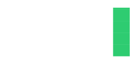

# Futuroptimist 👋

*Building open-source tools so anyone can invent, automate & explore.*

Hi, I'm Futuroptimist. This repository hosts scripts and metadata for my [YouTube channel](https://www.youtube.com/channel/UCA-J-opDpgiRoHYmOAxGQSQ). If you're looking for the full project details, see [INSTRUCTIONS.md](INSTRUCTIONS.md). Guidelines for AI tools live in [AGENTS.md](AGENTS.md). The automated tests run via GitHub Actions on each push and pull request and currently reach **100%** coverage.

## Related Projects
- **[token.place](https://token.place)** – stateless faucet for LLM inference with zero auth friction ([repo](https://github.com/futuroptimist/token.place))
- **[DSPACE](https://democratized.space)** – offline-first idle-sim where aquariums meet maker quests ([repo](https://github.com/democratizedspace/dspace))
- **[flywheel](https://github.com/futuroptimist/flywheel)** – opinionated boilerplate for reproducible CI and releases
- **[gabriel](https://github.com/futuroptimist/gabriel)** – guardian-angel LLM that nudges safer digital hygiene
- **[f2clipboard](https://github.com/futuroptimist/f2clipboard)** – bulk-copy files from nested dirs straight to your clipboard
- **[axel](https://github.com/futuroptimist/axel)** – LLM-powered quest tracker for repos and next steps
- **[sigma](https://github.com/futuroptimist/sigma)** – open-source AI pin device
- **[gitshelves](https://github.com/futuroptimist/gitshelves)** – turn GitHub contributions into 3D-printable block models
- **[wove](https://github.com/futuroptimist/wove)** – open-source toolkit for knitting and robotic looms
- **[sugarkube](https://github.com/futuroptimist/sugarkube)** – accessible k3s platform for off-grid Raspberry Pi clusters

## Contributions (issues & PRs I've opened)

  <!-- generated nightly via GitHub Actions -->
  

  <!-- yearly counts updated nightly -->
  

## Values

We aim for a positive-sum, empathetic community that shares knowledge openly.

---

Licensed under the [MIT License](LICENSE).
